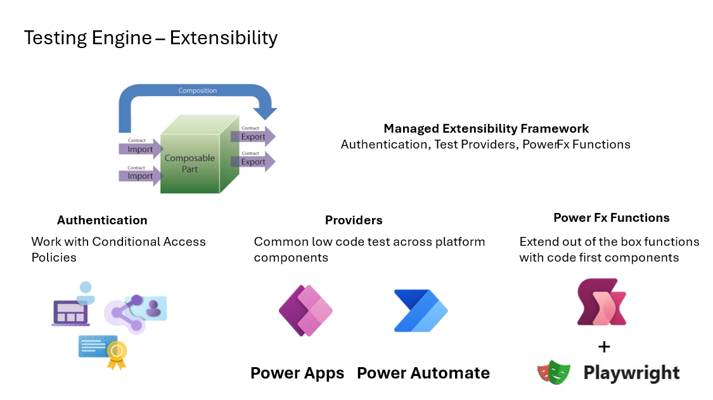
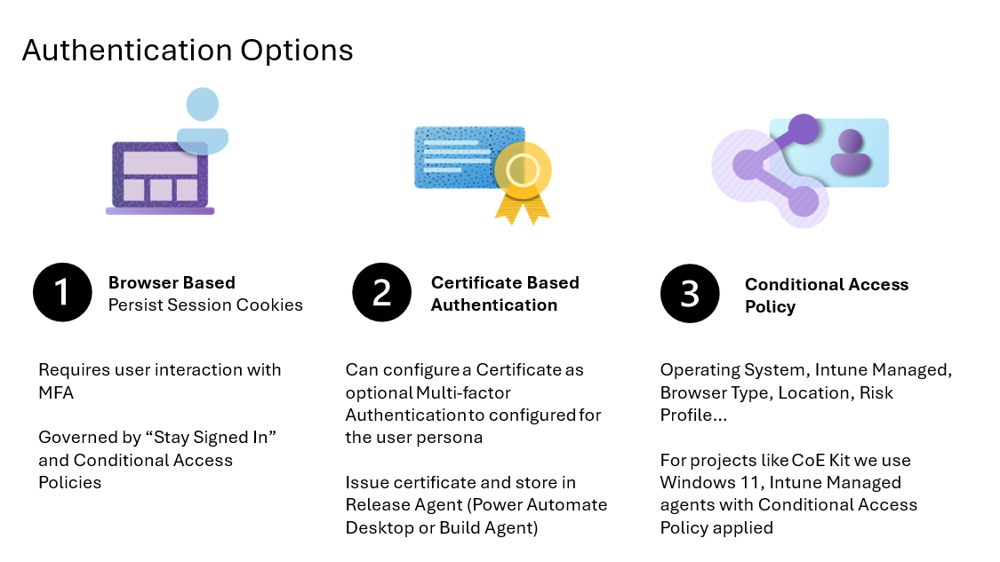
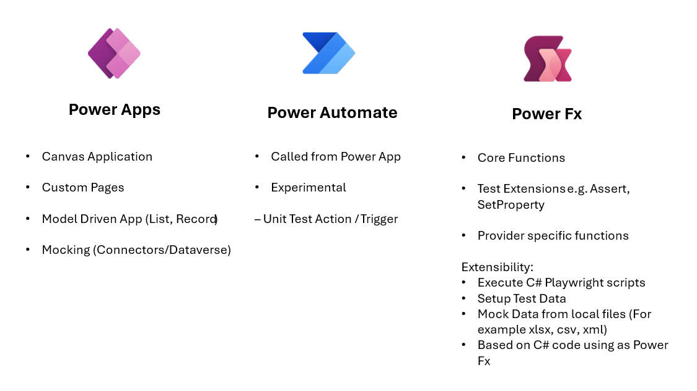

## Overview

This document provides an architectural overview of the Power Apps Test Engine. The engine consists of multiple layers, each with specific responsibilities that contribute to delivering a comprehensive and automated testing framework for Power Apps. The layers include the Test Engine, Test Definition, Test Results, and Browser, with an extensibility model available for User Authentication, Providers, and Power Fx.

The Power Apps Test Engine is a robust and modular framework that has been designed to facilitate comprehensive testing of various components within the Power Platform. At its core, the Test Engine features a Runner, which can be executed as part of the Power Platform Command Line Interface (PAC CLI) or through a build-from-source approach using open-source code. The PAC CLI option offers a supported and straightforward method to execute tests, while the build-from-source strategy, which requires the installation of the .Net SDK, lacks official support. 

Test suites and cases are formatted as YAML files, combining test settings and Power Fx Test Steps to define, manage and version the test cases. 

The test engine is made up of three extensible components for Authentication, Providers and Power Fx extensibility. Authentication is a foundational aspect, as test cases must authenticate with the Power Platform to run effectively. The Test Engine includes a set of modules, or Providers, that enable testing for Power Apps, including Canvas Applications and Model-Driven Applications, as well as experimental modules for Power Automate. The Power Fx Extensions allow for the extension of the Power Fx language, providing additional functions for Test Steps.

The results of tests can be added to standard CI/CD pipelines or uploaded to Dataverse to summarize and report on the outcome of a test.

## Layers

### Test Engine
The Test Engine is the core component of the testing framework.

- **pac test run:** Integrated into the product as a built-in feature.
- **Open source .Net application:** Available under open source licenses, allowing for customization and community contributions.

The Test Engine is responsible for orchestrating the entire testing process, invoking test cases, and managing the execution flow.

### Test Definition
Test Definition is where the specifics of what to test are outlined.

- **Yaml file:** Defines the test suite and individual test cases.
- **Power Fx:** Used to define the steps of a test case. Power Fx is a powerful, Excel-like formula language utilized in Power Apps.

The Yaml file format provides a flexible and human-readable way to specify test scenarios, while the Power Fx language allows for expressive and precise test steps.

### Test Results
Test Results summarize the outcomes of the tests.

- **Summarization:** Provides a concise overview of the tests executed, including pass/fail status, error messages, and other relevant metrics.

The results layer is essential for understanding the effectiveness and reliability of the tests and identifying areas for improvement.

### Browser

The Browser layer facilitates the automation of web browsers for providers that are testing web based Power Platform resources.

- **Wrapped Playwright:** Uses a wrapped version of Playwright for cross-browser automation.
- **JavaScript Wrappers:** Integration between the Provider and Test Engine is implemented through JavaScript wrappers. These wrappers are responsible for:
  - Collecting a list of items.
  - Controls and properties of items
  - Represention of controls as Power Fx records.
  - Represenation of lists as collections that can use functions like `CountRows()` or `Filter()`
  - Updating the underlying system based on Power Fx evaluations.

This layer ensures seamless interaction and manipulation of web elements during test executions.

## Extensibility Model

### User Authentication
Provides the capability to authenticate the test session.

User authentication contains Extensible Authentication Mechanisms. They allows for different methods of authentication to be plugged in, ensuring secure test sessions.

Current authentication providers and scenarios

| Type |	Description	| Considerations |
|------|------------------|-------------|
|Browser Persistent Cookies | One time login and using persistent cookies for headless login	 | 1.	Storage of Browser Context that contains Persistent Cookies |
|                           |  | 2.	Configuration of Persistent Cookie settings in Entra |
|                           |  | 3.	Conditional Access Policies |
| Certificate Based Authentication |	Configuration of Entra to allow Certificate Based Authentication |	1.	Issue and Revocation of Certificates
|                           |  | 2.	Certificate renewal process
| Conditional Access Policies	| Compliance with applied conditional Access polices	| 1.	Supported Browser type selection. For example, Edge, Chrome |
|                           |  | 2.	Test Agent network locations |
|                           |  | 3.	Risk profile of users |

Projects like the [CoE Starter Kit](https://github.com/microsoft/coe-starter-kit) are in the process of using these authentication providers as part of their automated tests.

### Providers

Enables the testing of various aspects of Power Apps.

- **Canvas Apps:** Supports testing of canvas applications.
- **Model-driven Apps (MDA):** Supports testing of model-driven applications.

This extensibility ensures that the Test Engine is versatile and can cater to different types of Power Apps.

Notes:
1. Providers for Co Pilot Studio, Power Pages are being considered.
2.	The Canvas and Model Driven application providers have a dependency on installation of Playwright on the local environment or test agent to execute the web based tests.
3.	Power Automate unit testing is executed against the definition of the Cloud Flow xml in memory or from Dataverse.

#### Canvas Apps

The Canvas Apps provider is designed to facilitate interaction with canvas applications during test execution.

- **JavaScript Interface:** The provider includes a JavaScript script with the canvas application.
- **Interaction with JavaScript Object Model:** This script interacts with the JavaScript Object Model (JSOM) of the page.
- **Updating Power Fx State:** The script updates the Power Fx state with the controls and properties of the canvas app.
- **State Management:** When functions like `SetProperty` are included in a test step, the state of the page is updated via the JavaScript object model.

This mechanism ensures that the Test Engine can effectively read and manipulate the state of canvas applications, enabling comprehensive testing capabilities.

#### Model-driven Apps (MDA)
The Model-driven Apps provider is designed to enable interaction with model-driven applications during test execution.

- **Views, Details, Custom Pages:** Supports automated testing of different components within model-driven apps including views, detail pages, and custom pages.
- **Command Bars, Navigation:** Enables interaction with command bars and navigation elements of the application.
- **JavaScript Interface:** The provider includes a JavaScript script with the model-driven application.
- **Interaction with JavaScript Object Model:** This script interacts with the JavaScript Object Model (JSOM) of the page.
- **Updating Power Fx State:** The script updates the Power Fx state with the controls and properties of the model-driven app.
- **State Management:** When functions like `SetProperty` are included in a test step, the state of the page is updated via the JavaScript object model.

The Model-driven Apps provider follows the same pattern as the Canvas Apps provider, ensuring a consistent approach to state management and control interaction, thereby enabling comprehensive testing of model-driven applications.

### Power Fx

The test steps of a test file include in the ability to make use of Power Fx to define how you would like to test you solution. There are functions like [Assert()](./PowerFX/Assert.md) to vertify if the state is as expected. Other functions like [Select()](./PowerFX/Select.md) to select a item.

#### Extensibility

Facilitates the addition of custom Power Fx functions.

- **Custom Functions:** Are used to extend the functionality by adding new Power Fx functions tailored to specific testing needs or each provider.

This enhances the flexibility and power of the Test Engine, making it adaptable to varied testing requirements.
