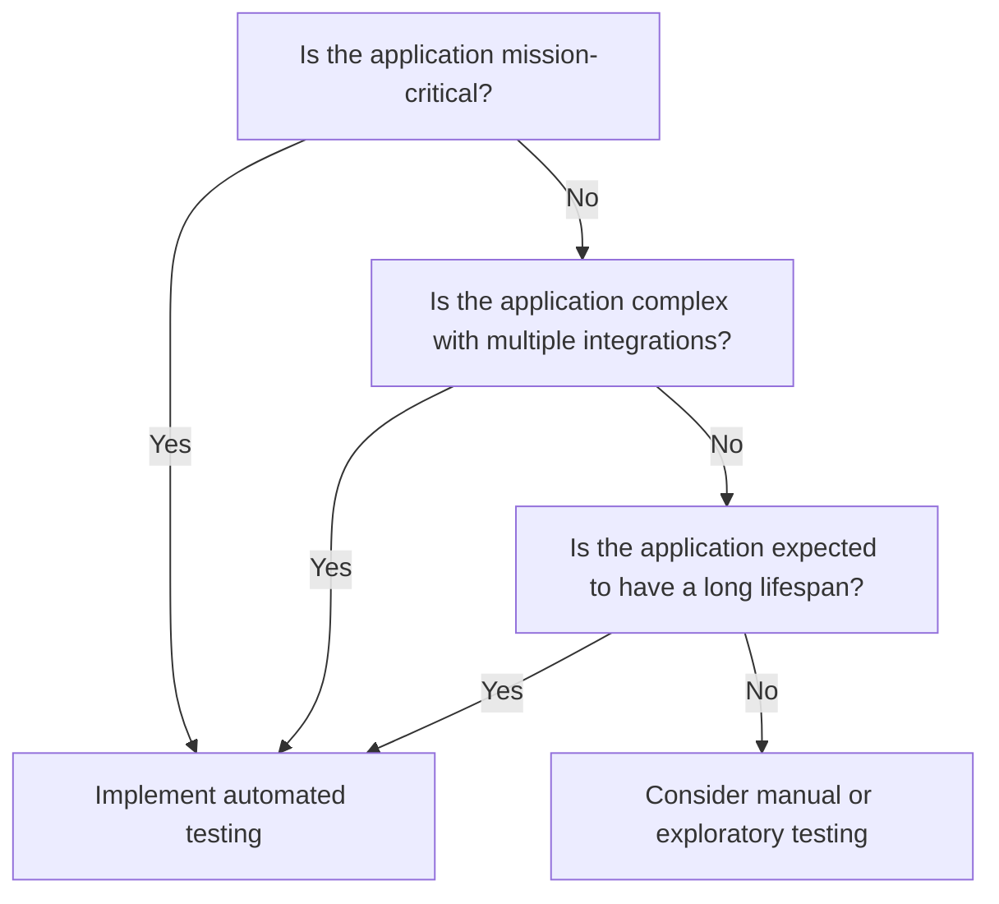

In the ever-evolving landscape of software development, the question of whether every solution requires automated testing is a topic of considerable debate. Automated testing, with its promise of efficiency and reliability, has become a cornerstone of modern development practices. However, the necessity and extent of its application can vary significantly depending on the context and nature of the project.

## Decisions and Tradeoffs

Given this context, making decisions can sometimes be challenging. To help with this, we have created the following decision tree. Read on to understand some of these choices and trade-offs.

## The Case for Automated Testing

Automated testing offers numerous benefits that make it an attractive option for many development teams. One of the primary advantages is the ability to execute repetitive tests quickly and accurately, which is particularly valuable in large-scale projects with extensive codebases. Automated tests can be run frequently, ensuring that new changes do not introduce regressions (unintended side effects that break existing functionality) and that the software remains stable over time.

Moreover, automated testing can enhance the reliability of the software by catching bugs (errors or flaws in the software) early in the development cycle. This early detection can save significant time and resources, as fixing issues later in the process is often more costly and complex. Automated tests can also provide a safety net for refactoring efforts (restructuring existing code without changing its external behavior), allowing developers to make changes with confidence that existing functionality will not be inadvertently broken.

## Context Matters

Despite its advantages, automated testing is not a one-size-fits-all solution. The decision to implement automated tests should be guided by the specific needs and constraints of the project. For instance, in projects with a short lifespan or limited scope, the overhead of setting up and maintaining automated tests may outweigh the benefits. In such cases, manual testing or exploratory testing might be more appropriate.

### Manual Testing

Manual testing is a process where testers manually execute test cases without the use of automation tools. This type of testing is performed by humans who interact with the software to identify defects. Manual testing is particularly useful for:

- **Ad-hoc Testing**: Quickly checking new features or changes without setting up automated tests.
- **Usability Testing**: Assessing the user experience and interface, which often requires human judgment.
- **Exploratory Testing**: Actively exploring the software to find defects that might not be covered by predefined test cases.

### Exploratory Testing

Exploratory testing is an informal testing approach where testers actively explore the software to find defects. Unlike scripted testing, exploratory testing does not follow a predefined set of test cases. Instead, testers use their creativity and intuition to identify potential issues. This type of testing is useful for:

- **Identifying Edge Cases**: Finding defects that occur under unusual or unexpected conditions.
- **Learning the Software**: Gaining a deeper understanding of the software's functionality and behavior.
- **Adapting to Changes**: Quickly adjusting to new features or changes in the software without needing to update test scripts.

## Test Method Examples

### Personal Productivity Automated Flow

Consider a simple Power Automate flow designed for personal productivity. This flow might send a reminder to follow up on emails or tasks. The flow is straightforward, with minimal complexity and limited impact if it fails. In such cases, manual testing might suffice, as the cost and effort of automated testing may not be justified. In this case Manual or Explority testing could be selected.

### Wide Impact, Department-Wide or Organization-Wide Solutions

In contrast, more complex solutions that affect entire departments or the organization require a different approach. For example, a Power Platform app that manages employee onboarding across multiple departments involves various workflows (sequences of automated steps), data integrations (combining data from different sources), and user interactions. Automated testing becomes crucial to ensure that all components work seamlessly together and that any changes do not disrupt the overall process.

Let's look at some possible examples of these wider impact solutions that could benefit from automated testing:

- **Streamlining Employee Onboarding**: A company leveraged Power Automate, Dataverse (a data storage and management service), and AI Builder (a tool for adding artificial intelligence to apps) to streamline their employee onboarding process. By automating repetitive tasks and integrating various data sources, they significantly reduced the time and effort required to onboard new employees. This solution not only improved efficiency but also enhanced the overall onboarding experience for new hires.

- **Boosting Team Efficiency**: An organization used Power Automate and Copilot Studio (a tool for building automated workflows) to boost team efficiency and improve customer experience. By automating routine tasks and providing real-time insights, they enhanced their service delivery and ensured a seamless experience for their customers.

- **Streamlining Business Processes**: A company utilized Power Automate, AI Builder, and Generative AI (a type of artificial intelligence that can create new content) to streamline various business processes. By automating workflows and integrating AI capabilities, they improved operational efficiency and provided better service to their customers. This solution helped them stay competitive in a rapidly changing industry.

- **Engaging Pro-Developers**: An enterprise engaged pro-developers (experienced software developers) to build enterprise-wide apps using Power Platform. This approach allowed them to create robust and scalable solutions that addressed complex business needs. By leveraging the power of Power Platform, they accelerated development and delivered high-quality applications.

- **Creating Enterprise App for Onboarding**: A large organization created an enterprise app for onboarding across multiple technologies and complex projects using Power Platform, Azure (a cloud computing service), and third-party services. This comprehensive solution streamlined the onboarding process, ensuring that new employees had access to the resources and information they needed from day one.

## Power CAT Examples

A great example of where automated testing is required is the [Center of Excellence (CoE) Starter Kit](https://learn.microsoft.com/power-platform/guidance/coe/starter-kit). This solution is used by thousands of customers globally and needs to be updated frequently to incorporate new product features and be supported over a long period of time. Additionally, it needs to be tested across many geographies around the world to ensure consistent performance and reliability. The CoE Starter Kit is made up of Power Apps, which are applications built using the Power Platform. Given its wide usage and the need for frequent updates, automated testing is essential to maintain the quality and functionality of the solution. 

For more information on this example look at [Power CAT - CoE Kit](/PowerApps-TestEngine/roles-and-responsibilities/powercat#coe-kit-and-test-automation)

