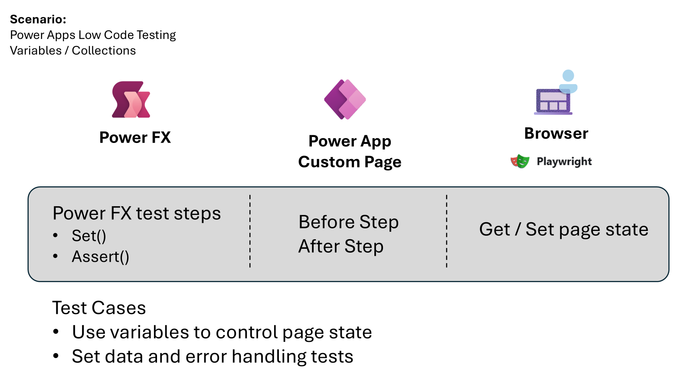

## Introduction
In Power Apps, the Test Engine provides a robust capability to test variables and collections on custom pages. This article explores the essentials of Power FX variables and collections, their common uses, and the role of testing in simplifying application state management.



## What are Power FX Variables and Collections?
Power FX variables and collections are fundamental components in Power Apps that help manage the state and data within an application. 

### Variables
Variables in Power FX are used to store values that can change over time. They are essential for controlling the state of the application, such as toggling visibility, storing user inputs, or managing session data.

### Collections
Collections are used to store tables of data that can be queried and manipulated. They are often used to fetch data from connectors and serve as data sources for controls like Grids and Galleries.

## Common Examples of Variable Usage
Variables are commonly used to:
- Control the visibility of controls based on user interactions.
- Store temporary data such as user inputs or session-specific information.
- Manage the state of forms, such as tracking whether a form is in edit or view mode.

## Using Collections to Query Data
Collections are powerful for:
- Querying data from external connectors and APIs.
- Storing and manipulating data locally within the app.
- Serving as data sources for Grids and Galleries, enabling dynamic data presentation.

## The Role of Testing in Power Apps
Testing is crucial for ensuring that the application behaves as expected. By querying and updating the state of the application, testing simplifies the process of verifying functionality without inferring state from control values.

### Using the `Set()` Function in Test Steps
The `Set()` function is instrumental in testing as it allows developers to change the state of the application directly. This capability is vital for:
- Testing expected scenarios by setting variables to specific values.
- Handling edge case data scenarios by simulating unusual or extreme inputs.
- Managing error handling scenarios by setting variables to trigger error conditions.

## Common Approaches to Testing
In traditional code-first applications, mocking is a common approach to simulate different states and behaviors. In Power Apps, the low-code nature of the platform, combined with the `Set()` function, makes testing more accessible and approachable. This approach allows developers to:
- Easily set up test scenarios without extensive coding.
- Quickly verify the behavior of the application under various conditions.
- Ensure that the application handles edge cases and errors gracefully.

## CoE Starter Kit Example

The [Setup and Upgrade Wizard](./coe-kit-setup-and-install-wizard.md) of the CoE Starter Kit provides a good example of working with global variables. The state of the page, which includes the current state of the Subway Navigation control and the wizard steps, is controlled by a common variable. This application is made up of multiple screens that allow the user to verify that the different elements of the CoE Starter Kit have been set up and are in a working state.

### Power FX Test Scenario

Let's look at how the test engine helps with testing this scenario. This example demonstrates that by being able to interact with the Power FX variables, it greatly simplifies the testing of this application as a key global variable controls the state of the application. By being able to get and set the variable rather than having to infer where in the process the app is, the variable can easily be asserted to verify the state of the app.

Key parts of this [example test](https://github.com/microsoft/PowerApps-TestEngine/blob/main/samples/coe-kit-setup-wizard/testPlan.fx.yaml) that start the test and set the initial state


```powerfx
Preview.ConsentDialog(Table({Text: "Center of Excellence Setup Wizard"}));
Set(configStep, 1); 
Assert(configStep=1);
```

Some key points

1. The ability for the test to conditionally wait until the optional Consent Dialog is completed.
2. The Power FX provider for Model Driven Application custom pages has updated the Power Fx state with the initial state.
3. The `Set(configStep, 1)` function call updates the step of the upgrade process to the Confirm pre-requisites step. By updating this variable, the Power Apps Provider updates the Model Driven Application custom page state.
4. Using `Assert()` and `CountRows()` could be functions to check that the state of the app and the selected data. This could be extended to filter functions to ensure the specific status of the required components.
5. Selection of the Next button using `Select(Next)` to move to the second step given the state of variables is known.

## Conclusion
The Test Engine in Power Apps provides a powerful framework for testing variables and collections. By leveraging the `Set()` function and understanding the role of variables and collections, developers and makers can create robust and reliable applications. Testing not only ensures functionality but also enhances the overall user experience by catching issues early in the process.