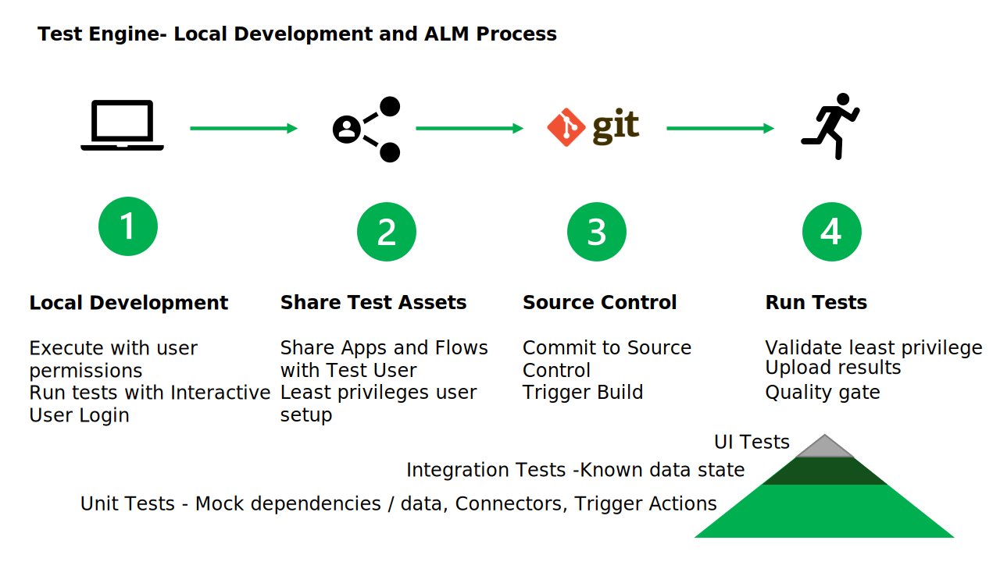

# Test Authoring

The following test authoring method exist for different personas to create and edit tests:

| Method| Description |	Considerations
|-------|-------------|------------------|
| Test Studio| Record of test and export as Test Engine Yaml |	1.	Limitations in support as documented in [Test Studio - Power Apps \| Microsoft Learn](https://learn.microsoft.com/power-apps/maker/canvas-apps/test-studio#known-limitations)
| Visual Studio Code Extension	| Experimental Visual Studio Code extension that offers Text Completion and Syntax validation | 1.	Extension are still work in progress
| | | 2.	More likely to meet the skill level of advanced makers and code first developers
| AI Generated Tests | Use of Generative AI to define test cases and test steps |1.	AI Generated tests is not yet a Generally available feature.

## Generative AI in Testing

Generative AI can be used to create test cases, automate repetitive tasks, and analyze test results, enhancing efficiency and accuracy across the board. By using Generative AI the process of creating and editing tests for each persona can be simplified and augumented to improve and maintain test coverage.

NOTE: 
1. This is an area of active research and development by the Power Platform Engineering team and arguments the ability to author and maintain tests without needing deep testing expertise.

## Local Development and ALM Process

The end to end process for test engine could be th following:

1. **Local Development** - Develop tests on local PC. At this stage the permissions of the maker can be used.

2. **Share Test Assets** - Share the Power Apps with test user account. Provide access to Managed Identity or Service principal to the definition of the Power Apps, Power Automate flows or Co-pilot.

   The user account that is setup with User permissions only. The user account must have created connection id to the required connectors.

3. **Commit Changes** - Save the changes to source control which will trigger build.

4. **Run Tests** - For unit tests they should be run with least privilege. Verify that:

   - User accounts only have permissions to start the application
   - By default that all Dataverse and Custom Connectors are mocked so that they cannot update source systems

### Test Types

Typically the majority of tests should be unit tests. As the test engine evolves, it will allow finer graned control of test that can test the Power Fx that makes up the App. For Power Automate testing providers exist that allow for unit tests based on the cloud flow definition with testing at the trigger and action level.

Integration tests should be a smaller percentage of tests as the take longer to create and need to manage the state of system and secure access to secure resources. For Power Apps the Application must be published first so that an integration Test can be executed. To make the tests indepenant of connectors and dataverse state mocks can be used.

Finally UI tests conducted manual should be the smalled amount of tests as they require the greatest amount of review and human intervention to run and validate test results.
